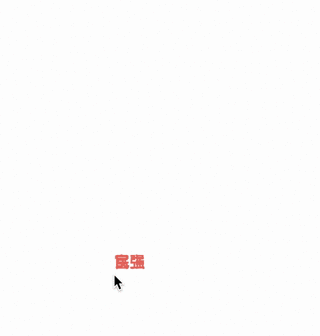

# click-popup

[](https://travis-ci.org/imcuttle/click-popup)

<!--[](https://codecov.io/github/imcuttle/click-popup?branch=master)-->

[](https://www.npmjs.com/package/click-popup)
[](https://www.npmjs.com/package/click-popup)
[](https://prettier.io/)
[](https://conventionalcommits.org)

The interaction about funny popup animation



- [Live Demo](https://imcuttle.github.io/click-popup)

## Installation

```bash
npm install click-popup
# or use yarn
yarn add click-popup
```

## Usage

```javascript
import clickPopup from 'click-popup'

const span = document.createElement('span')
span.textContent = '民主'
const dispose = clickPopup(
  ['富强', span, '文明', '和谐', '自由', '平等', '公正', '法治', '爱国', '敬业', '诚信', '友善'],
  document.body,
  {
    index: 0,
    styleMapper: style => ({ ...style, color: 'rgb(255,102,81)', fontSize: 12, fontWeight: 'bold' })
  }
)

// Call `dispose()` for removing
```

## API

### `clickPopup(nodeList: Array<Node|string>, Node, options?)`

#### options

- `index`: start index (Type: `number`, Default: `0`)
- `styleMapper`: style mapper (Type: `(style, currentNode) => style`, Default: `sty => sty`)
- The rest of options see [popmotion - tween](https://popmotion.io/api/tween/#tween-props)

## Related

- [popmotion](https://github.com/Popmotion/popmotion) - Simple animation libraries for delightful user interfaces

## Authors

This library is written and maintained by imcuttle, <a href="mailto:moyuyc95@gmail.com">moyuyc95@gmail.com</a>.

## License

MIT
